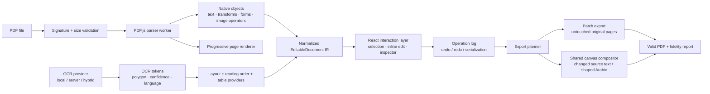

# PDF Editor architecture

PDF Editor is a semantic PDF editor, not a screenshot editor. The source of truth is an `EditableDocument` intermediate representation (IR); the rendered PDF is a view of the source document and the semantic edit layer is a separate interaction surface.

## Current proof-of-concept scope

The browser implementation now validates the highest-risk client path:

1. Validate the PDF signature and size before parsing.
2. Parse a native PDF with PDF.js in a worker.
3. Extract native text items, placement matrices, font identifiers, annotations, and image paint operations.
4. Normalize those into stable semantic objects in one top-left point coordinate system.
5. Render each native page at a high-quality preview scale and create a companion render with native text paint operations removed for exact background restoration.
6. For image-only scanned pages, render a separate 300 dpi canvas and recognize Arabic + English text locally in a browser worker.
7. Support selection, inline text editing, a property inspector, add-text, delete, duplicate, Unicode-aware search, and operation history.
8. Export untouched inputs through the native patch path and route changed/deleted source text through the high-resolution flattened compositor so edits are never silently dropped.

This is deliberately not a claim that arbitrary native PDF content streams can already be rewritten losslessly in the browser. The editor reconstructs changed source text visually from a text-free source render, preserves overlapping runs and source paint-order occlusions, and labels the result as flattened; a future worker is still required for lossless content-stream rewriting.

## Processing pipeline

## Package boundaries

| Module | Responsibility | UI-free |
| --- | --- | --- |
| `app/lib/document-model.ts` | Strict IR, text metadata, stable IDs, demo fixture | Yes |
| `app/lib/pdf-core.ts` | PDF.js loading, native text/form/image extraction, viewport rendering | Yes |
| `app/lib/recognition.ts` | OCR/layout/table provider interfaces, scan classification, reading order | Yes |
| `app/lib/local-ocr.ts` | Browser-local 300 dpi Arabic + English OCR worker and geometry normalization | Yes |
| `app/lib/export-engine.ts` | Export strategy selection, valid PDF patch/reconstruction proof of concept | Yes |
| `app/lib/text-compositor.ts` | Source restoration, overlap planning, font loading, and preview/export text painting | Yes |
| `app/page.tsx` | Interaction composition only: selection, tool state, history controls | No |

## Coordinate system

All `bbox` values are points relative to a page whose origin is at top-left. Native PDF coordinates are converted at import. Every object retains its source transformation matrix and rotation, so a reconstruction worker can reason about its original coordinate system rather than relying on DOM pixels.

## Arabic and mixed-direction text

The editor uses browser Unicode bidi handling (`dir="rtl"` / `dir="ltr"` and `unicode-bidi: plaintext`) and detects Arabic at object level. It never reverses Arabic strings. Mixed content remains a Unicode string in the document model and the browser performs shaping/visual ordering for the editing view.

Lossless export of newly-created or reconstructed Arabic needs two additional worker dependencies: an embeddable Arabic font and HarfBuzz shaping. Until those are present, the export planner uses the browser-shaped high-resolution visual fallback instead of emitting disconnected Arabic glyphs or substituting an incompatible PDF font.

## Export strategies

| Strategy | Status | Intended use |
| --- | --- | --- |
| Patch | Implemented for untouched inputs and new Latin text | Keeps unmodified original pages as PDF objects |
| Reconstruction | Planned worker contract | Lossless changed native content, table edits, shaped Arabic text |
| Flatten | Implemented fidelity fallback | Changed/deleted source text and browser-shaped Arabic when native rewriting is unsafe |
| OCR layer | Provider contract | Scanned page with a searchable text layer |
| Optimize | Planned | Compression and font subsetting after fidelity validation |

## Security posture

The browser path validates `%PDF-` before parsing, limits this proof of concept to 100 MB, disables PDF.js JavaScript evaluation, and does not send page imagery to an OCR service. Image-only scans are recognized in a local Web Worker using downloaded Arabic and English model files. OCR blocks remain source-locked until the recognition contract includes a persistent glyph-accurate cleanup mask; rectangular token bounds alone are never treated as safe erasure masks. A future server-assisted provider must make upload consent and retention policy explicit.

## Production worker roadmap

The next worker package should own expensive, cancellable work: page-level OCR, OpenType inspection, HarfBuzz shaping, vector/image extraction, table inference, and granular page reconstruction. Its inputs and results should be versioned IR messages so browser-only, hybrid, and server modes can use the same editor state and test fixtures.
